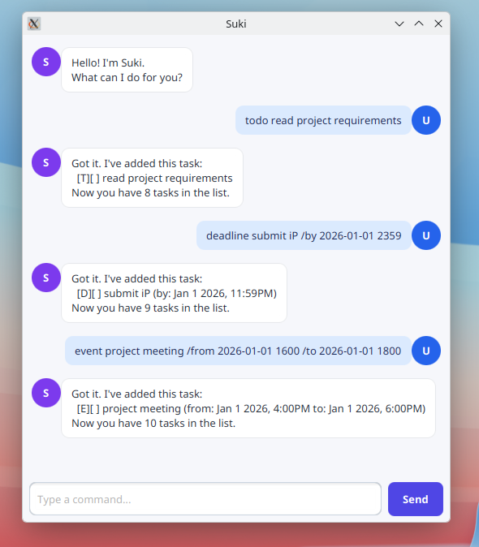

# Suki User Guide

Suki is a friendly desktop task manager that keeps your todos, deadlines, and
events in one place. Type a command in the box at the bottom of the window and
press **Enter** or click **Send**.



## Quick start

1. Install Java 25.
2. Download `suki.jar` from the latest GitHub release.
3. Open a terminal in the folder containing the JAR and run:

   ```shell
   java -jar suki.jar
   ```

Suki saves your tasks automatically in `data/suki.txt`, relative to the folder
from which you start the app. You do not need to create this file yourself.

## Command summary

| Action | Command |
|---|---|
| Add a todo | `todo DESCRIPTION` |
| Add a deadline | `deadline DESCRIPTION /by DATE_TIME` |
| Add an event | `event DESCRIPTION /from DATE_TIME /to DATE_TIME` |
| Show all tasks | `list` |
| Mark a task as done | `mark NUMBER` |
| Mark a task as not done | `unmark NUMBER` |
| Delete a task | `delete NUMBER` |
| Find tasks | `find KEYWORD` |
| Sort dated tasks | `sort` |
| Say goodbye | `bye` |

Task numbers are shown by `list`, `find`, and `sort`. Dates can use any of
these formats:

- `yyyy-MM-dd`, such as `2026-09-18`
- `d/M/yyyy`, such as `18/9/2026`
- Either date followed by a 24-hour time, such as `2026-09-18 2359`

## Adding a todo

Use a todo for a task with no specific date.

```text
todo read project requirements
```

Suki adds the todo and shows its task count.

## Adding a deadline

Use `/by` to specify when a task is due.

```text
deadline submit iP /by 2026-09-18 2359
```

Suki rejects missing or impossible dates, such as `2026-02-30`, and explains
the accepted formats.

## Adding an event

Use `/from` and `/to` to specify the event's time range. The ending date and
time must be later than the starting date and time.

```text
event project meeting /from 2026-09-15 1400 /to 2026-09-15 1600
```

## Listing tasks

```text
list
```

Suki displays every task with its number, type, and completion status:

```text
1.[T][ ] read project requirements
2.[D][ ] submit iP (by: Sep 18 2026, 11:59PM)
```

`T`, `D`, and `E` mean todo, deadline, and event. `[X]` means the task is
done; `[ ]` means it is not done.

## Marking and unmarking tasks

Use the number shown by `list`:

```text
mark 1
unmark 1
```

Suki reports an error if that task number does not exist.

## Deleting a task

```text
delete 2
```

Suki shows the removed task and the number of tasks remaining. Deletion cannot
be undone from within the app.

## Finding tasks

```text
find project
```

Search is case-insensitive and matches text anywhere in a task description.
For example, `find BOOK` matches both `read book` and `return Book`.

## Sorting tasks by date

```text
sort
```

Suki places the earliest deadlines and events first. Todos have no date, so
they appear after all dated tasks. The new order is saved and used by future
`list` commands.

## Exiting

```text
bye
```

Closing the window is also safe because Suki saves changes after every
successful command.

## Troubleshooting

- **Suki highlights a reply in red:** The command was invalid. Read the reply
  for an example of the expected format, correct the command, and try again.
- **The JAR does not start:** Run `java -version` and confirm it reports Java
  25, then start the app from a terminal using `java -jar suki.jar` so you can
  see any error message.
- **My saved tasks are missing:** Start Suki from the same folder each time.
  Its `data/suki.txt` path is relative to the current folder.
